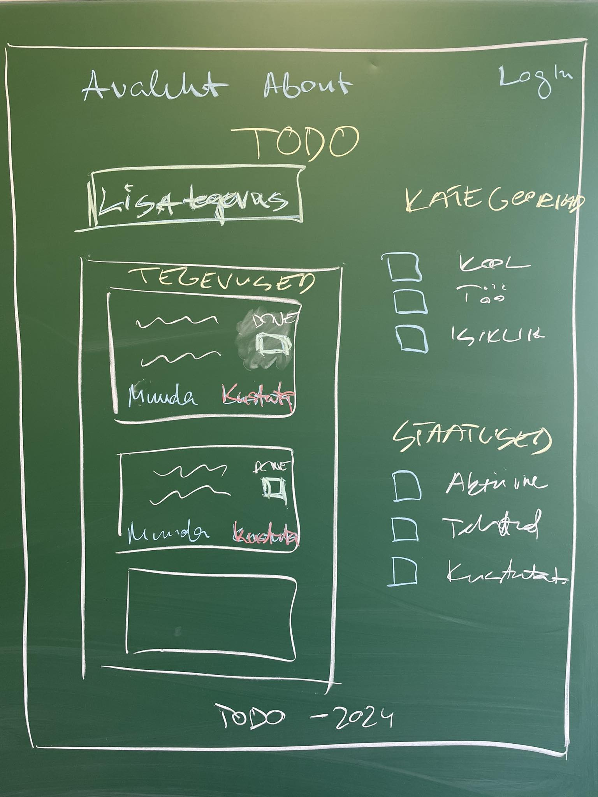

# TODO rakendus

## Prototüüp



## Ressursid

### Tegevus - TODO

- ID
- Pealkiri
- Sisu
- Loomise kuupäev
- Tähtaeg
- Kasutaja ID
- Staatus ID
- Kategooria ID

Näiteks:
  
```json
{
  "id": 1,
  "title": "Kooli kodutöö",
  "content": "Matemaatika lehekülg 10",
  "created": "2021-01-01T12:00:00Z",
  "deadline": "2021-01-02T12:00:00Z",
  "userId": 1,
  "statusId": 1,
  "categoryId": 1
}
```

### Kasutaja

- ID
- Eesnimi
- Perenimi
- E-post
- Parool
- Loomise kuupäev
- Staatus ID
- Roll ID

Näiteks:

```json
{
  "id": 1,
  "first_name": "John",
  "last_name": "Doe",
  "email": "john@doe.ee",
  "password": "123456",
  "created": "2021-01-01T12:00:00Z",
  "statusId": 1,
  "roleId": 1
}
```

### Kategooria

- ID
- Pealkiri (näiteks: Kool, Töö, Isiklik)
- Kirjeldus
- Loomise kuupäev
- Staatus ID

Näiteks:

```json
{
  "id": 1,
  "title": "Kool",
  "description": "Kooliga seotud tegevused",
  "created": "2021-01-01T12:00:00Z",
  "status": 1
}
```

### Roll

- ID
- Pealkiri (näiteks: Admin, Kasutaja)
- Kirjeldus
- Loomise kuupäev
- Staatus ID

Näiteks:

```json
{
  "id": 1,
  "title": "Admin",
  "description": "Administraatori roll",
  "created": "2021-01-01T12:00:00Z",
  "statusId": 1
}
```

### Staatus

- ID
- Pealkiri (näiteks: Aktiivne, Lõpetatud, Tühistatud, Kustutatud)
- Kirjeldus
- Loomise kuupäev

Näiteks:

```json
{
  "id": 1,
  "title": "Aktiivne",
  "description": "Ressurss on aktiivne",
  "created": "2021-01-01T12:00:00Z"
}
```
